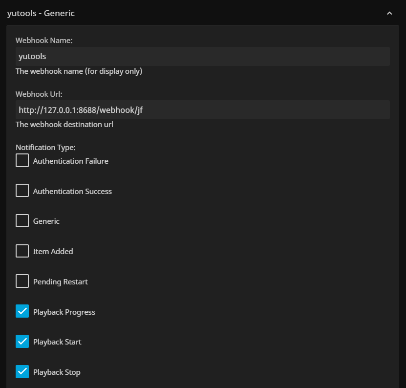

# yu-tools

一个NAS辅助工具java服务


### 现有功能：
1.手动刷新jellyfin媒体库，浏览器访问：http://127.0.0.1:8688/jellyfin/media/refresh
<br>
2.MoviePilot下载删除/完成后：自动发送telegram机器人消息（可选：需配置tgBotToken、tgChatId参数）、自动刷新jellyfin媒体库<br>
(MoviePilot需安装webhook插件，配置POST请求，配置本服务webhook地址：http://127.0.0.1:8688/webhook/mp)
<br>
<br>
3.jellyfin有在线用户观看时，自动更新qBittorrent上传限速，内网设备可通过编辑设备名加入**internal**字符进行排除<br>
(jellyfin需安装webhook插件，NotificationType项至少勾选"Playback Progress"，配置本服务webhook地址：http://127.0.0.1:8688/webhook/jf)
<br>

<br>

### java启动命令：
```
java -DjfUrl={url} -DjfToken={apiToken} \
-DmpUrl={mpUrl} -DmpUser={mpUser} -DmpPwd={mpPwd} \
-DqbUrl={qbUrl} -DqbUser={qbUser} -DqbPwd={qbPwd} \
-DqbUMin={qbUMin} -DqbUMax={qbUMax} -DqbUMPU={qbUMPU} \
-DtgBotToken={tgBotToken} -DtgChatId={tgChatId} \ 
-jar yu-tools.jar
```

### docker启动命令（将jar包放至宿主机"/opt/jar/"目录下）：
```
docker run -d \
 --name=yu-tools \
 --restart unless-stopped \
 -p 8688:8688 \
 -e TZ=Asia/Shanghai \
 -v /opt/jar/yu-tools.jar:/opt/jar/yu-tools.jar \
 java:8u111 java \
  -DjfUrl={url} \
  -DjfToken={apiToken} \
  -DmpUrl={mpUrl} \
  -DmpUser={mpUser} \
  -DmpPwd={mpPwd} \
  -DqbUrl={qbUrl} \
  -DqbUser={qbUser} \
  -DqbPwd={qbPwd} \
  -DqbUMin={qbUMin} \
  -DqbUMax={qbUMax} \
  -DqbUMPU={qbUMPU} \
  -DtgBotToken={tgBotToken} \
  -DtgChatId={tgChatId} \
  -jar /opt/jar/yu-tools.jar
```

### 参数说明：
| 参数               | 是否必填 | 说明             | 示例                             |
| ------------------ | -------- | ---------------- | -------------------------------- |
| -DjfUrl  | 否       | jellyfin 访问地址     | http://127.0.0.1:8096            |
| -DjfToken| 否       | jellyfin API密钥     | xxxxxxxxxxxxxxxxxxxxxxxxxxxxx |
| -DmpUrl  | 否       | MoviePilot API地址   | http://127.0.0.1:3001            |
| -DmpUser | 否       | MoviePilot 登录用户名 | admin |
| -DmpPwd  | 否       | MoviePilot 登录密码   | adminpassword |
| -DqbUrl  | 否       | qBittorrent 访问地址    | http://127.0.0.1:8080            |
| -DqbUser | 否       | qBittorrent 登录用户名 | admin |
| -DqbPwd  | 否       | qBittorrent 登录密码   | adminpassword |
| -DqbUMin  | 否       | qBittorrent 上传限速最小值（单位MB/s）   | 10 |
| -DqbUMax  | 否       | qBittorrent 上传限速最大值（单位MB/s）   | 0.5 |
| -DqbUMPU  | 否       | 单用户所需占用上传带宽（单位MB/s）   | 2 |
| -DtgBotToken | 否      | telegram 机器人token | xxxxxxxx:XXXXXXXXXXXXXXX |
| -DtgChatId   | 否      | telegram 机器人发送消息会话id | xxxxxxxxxx |

### 部署完成验证：
访问：http://127.0.0.1:8688/hello/world

### TODO：
1.待适配原生docker

<br>
待更新（有需要的功能欢迎提宝贵建议）...
